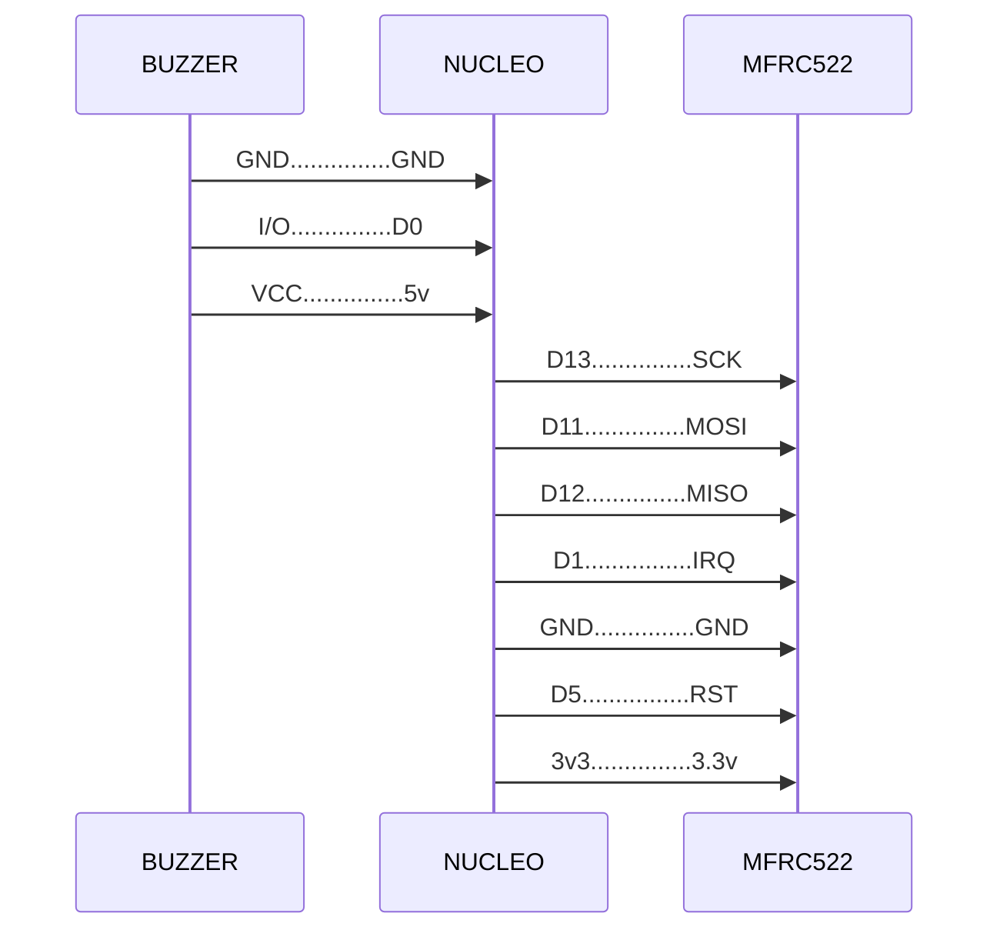

# resto-device
Embedded project for resto card reader

### Wiring



### Final application vision
``` C
// main.cpp

#include <Arduino.h>

#include "App.h"

App app();

void setup() {
  app.run()
}

void loop() {}
```