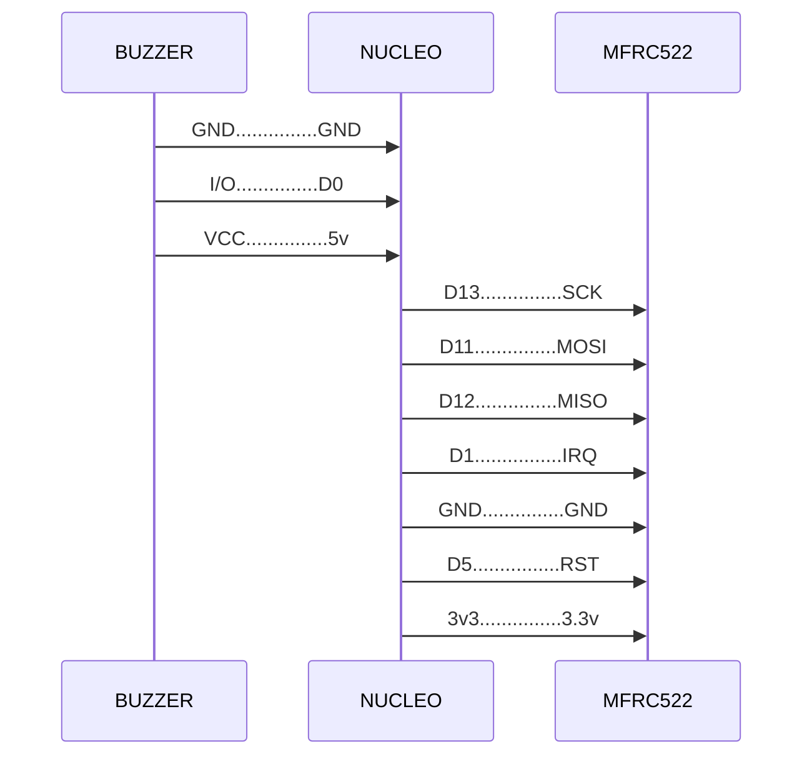

# resto-device
Embedded project for resto card reader

### Wiring



### Final application vision
``` C
// Clean code

#include <Arduino.h>

#include "Log.h"
#include "Led.h"
#include "Buzzer.h"
#include "CardReader.h"

#define MFRC522_RST_PIN          (5)
#define MFRC522_SPI_SS_PIN       (10)
#define MFRC522_IRQ_PIN          (1)
#define BUZZER_PIN               (0)
#define BUZZER_BEEP_DURATION_MS  (1000)
#define GREEN_LED_ON_DURATION_MS (1000)

static void onCardDetected(Card card);

static const char *TAG = "MAIN";

static CardReader cardReader(MFRC522_SPI_SS_PIN, MFRC522_RST_PIN, MFRC522_IRQ_PIN);
static Buzzer buzzer(BUZZER_PIN);
static Led greenLED(LED_GREEN);
static Log logger(&Serial);

void setup() {
  Payment payment;
  Order order("56780afa-e02a-4f89-9a67-c70988ebd023", 2, 3, 1693175157);

  logger.i(TAG, "App started...");

  cardReader.registerCallback(onCardDetected);
  cardReader.run();

  logger.d(TAG, "Initiating payment...");
  payment.initiate(order, [](Payment::Error result) {
    if (result == Payment::Error::Success) {
      logger.i(TAG, "Payment successful!");
    } else {
      logger.e(TAG, "Payment failed (result=%d)", result);
    }
  });
}

void loop() {}

static void onCardDetected(Card card) {
  logger.i(TAG, "UID: " + card.getUID());
  greenLED.asyncOn(GREEN_LED_ON_DURATION_MS);
  buzzer.asyncOn(BUZZER_BEEP_DURATION_MS);
}
```